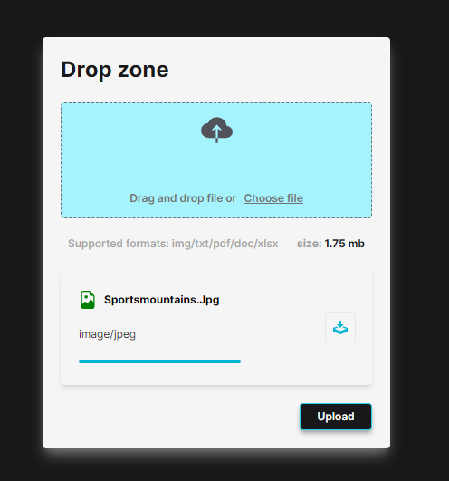

# Upload File

- Este é um projeto para facilitar o upload de arquivos de forma simples e eficiente. Até o momento, construi parcialmente o frontend utilizando Next.js, Tailwind CSS e React Icons, seguindo o padrão de componentes para uma experiência de usuário mais intuitiva.

## Visão Geral
- O objetivo principal deste projeto é permitir que os usuários carreguem arquivos de maneira rápida e fácil. Ele foi desenvolvido com a ideia de ser uma solução versátil para diferentes tipos de aplicativos que necessitam dessa funcionalidade. 

### Tecnologias Utilizadas Frontend:

> Next.js
> Tailwind CSS
> React Icons

**Backend (ainda em desenvolvimento):**

- NestJs
- Typescript
- PostgreSQL
#### Como Contribuir
Sinta-se à vontade para contribuir com este projeto! Seja por meio de correções de bugs, melhorias no código, ou até mesmo sugestões para novos recursos, todas as formas de contribuição são bem-vindas.

#### Instruções para Desenvolvedores: 
  Clone o repositório:
  - bash
  - Copy code
  - git clone https://github.com/seu-usuario/upload-file.git
#### Instale as dependências do frontend:
- bash
- Copy code
- cd upload-file/frontend
- npm install

#### Execute o servidor de desenvolvimento:
- bash
- Copy code
- npm run dev

> Para iniciar o desenvolvimento do backend, aguarde as atualizações futuras neste README.
Deploy
Este projeto está atualmente implantado na Vercel. Você pode acessá-lo aqui.

**Contato
Para qualquer dúvida, sugestão ou problema relacionado a este projeto, sinta-se à vontade para entrar em contato:**

meu email
[email](mailto:marcodamasceno0101@outlook.com)

GitHub Issues
[GitHub Issues](https://github.com/marcodmc/upload-file/issues)

Agradeço o seu interesse em contribuir para tornar este projeto ainda melhor!
